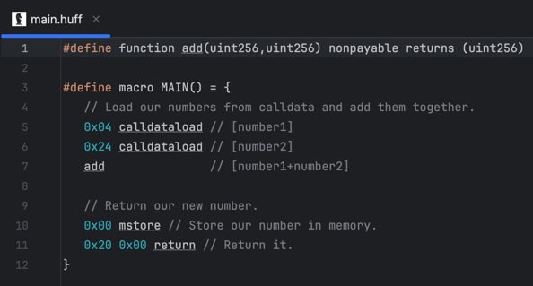

# IntelliJ Huff Plugin
<!-- Plugin description -->
This plugin adds [Huff Language](https://huff.sh) support to IntelliJ IDEs. It provides currently only syntax highlighting.
<!-- Plugin description end -->

## Installation
The plugin is available in the [JetBrains Marketplace](https://plugins.jetbrains.com/plugin/25782-huff-language). You can install it directly from the IDE by searching for "Huff Language". As alternative, you can download the latest release from the [releases page](https://github.com/cakevm/intellij-huff-plugin/releases) and install it manually.

## Status of development
Lexing and parsing of Huff files and basic syntax highlighting is working.

## Acknowledgements
The Lexer, Parser and the PSI class structure is bases on [intellij-solidity](https://github.com/intellij-solidity/intellij-solidity). Thank you! The foundation for this plugin is the [IntelliJ Platform Plugin Template](https://github.com/JetBrains/intellij-platform-plugin-template). The include parsing is heavily inspired by [candid-intellij-plugin](https://github.com/Alaanor/candid-intellij-plugin). The icon is taken from [vscode-huff](https://github.com/huff-language/vscode-huff/blob/master/resources/huff.png).

## Licence
This project is dual licensed under the [Apache 2.0](./LICENSE-APACHE) or [MIT](./LICENSE-MIT) licenses.
